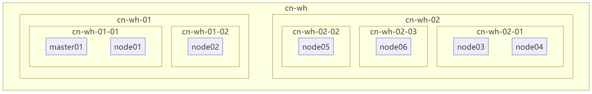

# LabelsToMermaind
kubernetes nodes  labels to Mermaind
# 背景
在验证K8S 调度器中的拓扑分布约束（Topology Spread Constraints）节点分布情况时，可以根据主机标签快速转换拓扑图方便核对
# 环境
``` 
kubectl version
Client Version: v1.30.5
Kustomize Version: v5.0.4-0.20230601165947-6ce0bf390ce3
Server Version: v1.30.4
```
```
jq --version
jq-1.7
```
# 过程
1. 获取所有节点标签
``` kubectl get nodes -o jsonpath='{range .items[*]}{.metadata.name}{" "}{range .metadata.labels}{.}{"="}{.}{" "}{end}{"\n"}{end}' > /tmp/k8s_node_labels_extracted.txt```
详细get-labels.sh文件

结果示例
```
==========================
master01, cn-wh, cn-wh-01, cn-wh-01-01, master01
node01, cn-wh, cn-wh-01, cn-wh-01-01, node01
node02, cn-wh, cn-wh-01, cn-wh-01-02, node02
node03, cn-wh, cn-wh-02, cn-wh-02-01, node03
node04, cn-wh, cn-wh-02, cn-wh-02-01, node04
node05, cn-wh, cn-wh-02, cn-wh-02-02, node05
node06, cn-wh, cn-wh-02, cn-wh-02-03, node06
```
2. 转换为Mermaind格式
``` cat /tmp/k8s_node_labels_extracted.txt | jq -R 'split(" ") | {node:.[0], labels: .[1:] | map({key: .[0], value: .[1]})}' > /tmp/subgraph.txt```
详细labelsTomermaind.sh

结果示例
```
graph TD
        subgraph cn-wh
            cn-wh-01
            cn-wh-02
        end
            subgraph cn-wh-01
                subgraph cn-wh-01-01
                master01
                node01
                
                end
                subgraph cn-wh-01-02
               node02

                end
            end
            subgraph cn-wh-02
                subgraph cn-wh-02-02
                node05

                end
                subgraph cn-wh-02-03
                node06

                end
                subgraph cn-wh-02-01
                node03
                node04

                end
            end
```
4. 输出到Mermaind
