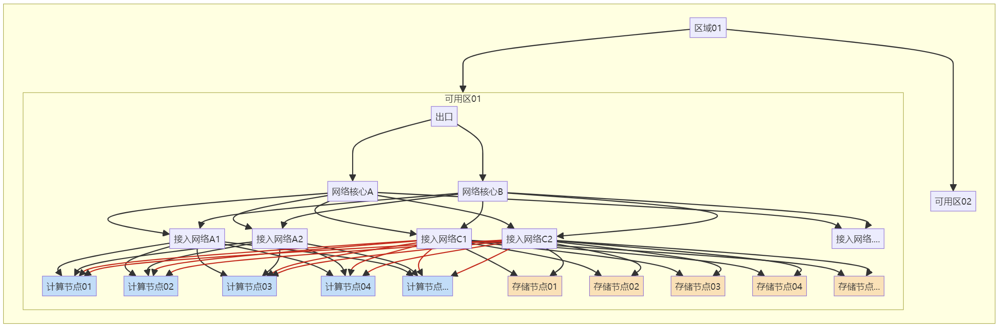
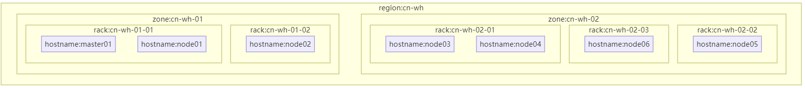

# 背景
在验证K8S调度器中的拓扑分布约束（Topology Spread Constraints）节点分布情况时，对于节点标签与基础架构拓扑之间的转换不方便，通常在已有的基础架构上对节点添加标签，但是添加标签后不方便校验是不是正确的，所以本文提供一种将节点标签转换为Mermaind格式的脚本，可以根据主机标签快速转换拓扑图方便核对
常见的基础架构如下：



简化的基础架构如下，去掉各种连接线，也符合官方风格（这里rack定义在验证文章专门说明）
下图也就是这次的目标


# 环境依赖
kubectl必须的，还需要jq
```
Ubuntu 24.04 LTS
```
``` 
kubectl version
Client Version: v1.30.5
Kustomize Version: v5.0.4-0.20230601165947-6ce0bf390ce3
Server Version: v1.30.4
```
```
jq --version
jq-1.7
```
# 通常查看节点标签
使用kubectl get nodes --show-labels命令可以查看节点标签，但是输出就是下面一堆，可读性太差
``` 
root@master01:~# kubectl get nodes --show-labels
NAME       STATUS     ROLES    AGE   VERSION   LABELS
master01   Ready      <none>   12d   v1.30.5   beta.kubernetes.io/arch=amd64,beta.kubernetes.io/os=linux,kubernetes.io/arch=amd64,kubernetes.io/hostname=master01,kubernetes.io/os=linux,topology.kubernetes.io/rack=cn-wh-01-01,topology.kubernetes.io/region=cn-wh,topology.kubernetes.io/zone=cn-wh-01
node01     NotReady   <none>   12d   v1.30.5   beta.kubernetes.io/arch=amd64,beta.kubernetes.io/os=linux,kubernetes.io/arch=amd64,kubernetes.io/hostname=node01,kubernetes.io/os=linux,topology.kubernetes.io/rack=cn-wh-01-01,topology.kubernetes.io/region=cn-wh,topology.kubernetes.io/zone=cn-wh-01
node02     NotReady   <none>   12d   v1.30.5   beta.kubernetes.io/arch=amd64,beta.kubernetes.io/os=linux,kubernetes.io/arch=amd64,kubernetes.io/hostname=node02,kubernetes.io/os=linux,topology.kubernetes.io/rack=cn-wh-01-02,topology.kubernetes.io/region=cn-wh,topology.kubernetes.io/zone=cn-wh-01
node03     NotReady   <none>   12d   v1.30.5   beta.kubernetes.io/arch=amd64,beta.kubernetes.io/os=linux,kubernetes.io/arch=amd64,kubernetes.io/hostname=node03,kubernetes.io/os=linux,topology.kubernetes.io/rack=cn-wh-02-01,topology.kubernetes.io/region=cn-wh,topology.kubernetes.io/zone=cn-wh-02
node04     NotReady   <none>   11d   v1.30.5   beta.kubernetes.io/arch=amd64,beta.kubernetes.io/os=linux,kubernetes.io/arch=amd64,kubernetes.io/hostname=node04,kubernetes.io/os=linux,topology.kubernetes.io/rack=cn-wh-02-01,topology.kubernetes.io/region=cn-wh,topology.kubernetes.io/zone=cn-wh-02
node05     NotReady   <none>   11d   v1.30.5   beta.kubernetes.io/arch=amd64,beta.kubernetes.io/os=linux,kubernetes.io/arch=amd64,kubernetes.io/hostname=node05,kubernetes.io/os=linux,topology.kubernetes.io/rack=cn-wh-02-02,topology.kubernetes.io/region=cn-wh,topology.kubernetes.io/zone=cn-wh-02
node06     NotReady   <none>   11d   v1.30.5   beta.kubernetes.io/arch=amd64,beta.kubernetes.io/os=linux,kubernetes.io/arch=amd64,kubernetes.io/hostname=node06,kubernetes.io/os=linux,topology.kubernetes.io/rack=cn-wh-02-03,topology.kubernetes.io/region=cn-wh,topology.kubernetes.io/zone=cn-wh-02

 ```
# 限制
节点标签按照官方推荐的region、zone、rack名称并定义拓扑层级进行,所以标签名字固定为topology.kubernetes.io/region、topology.kubernetes.io/zone、topology.kubernetes.io/rack、kubernetes.io/hostname 可以考虑实际情况进行修改，注意保证层级正确

# 步骤
1、获取所有节点标签

``` 
kubectl get nodes -o jsonpath='{range .items[*]}{.metadata.name}{" "}{range .metadata.labels}{.}{"="}{.}{" "}{end}{"\n"}{end}' > /tmp/k8s_node_labels_extracted.txt
```
详细查看get-labels.sh文件

k8s_node_labels_extracted.txt结果示例

```
==========================
master01, cn-wh, cn-wh-01, cn-wh-01-01, master01
node01, cn-wh, cn-wh-01, cn-wh-01-01, node01
node02, cn-wh, cn-wh-01, cn-wh-01-02, node02
node03, cn-wh, cn-wh-02, cn-wh-02-01, node03
node04, cn-wh, cn-wh-02, cn-wh-02-01, node04
node05, cn-wh, cn-wh-02, cn-wh-02-02, node05
node06, cn-wh, cn-wh-02, cn-wh-02-03, node06
```
其实这样看也算可以了，但是还不如拓扑图形直观

2、转换为Mermaind格式

下面开始转换为Mermaind格式
``` 
cat /tmp/k8s_node_labels_extracted.txt | jq -R 'split(" ") | {node:.[0], labels: .[1:] | map({key: .[0], value: .[1]})}' > /tmp/subgraph.txt 
```
详细查看get-mermaind.sh文件

subgraph.txt 结果示例
```
graph TD
        subgraph cn-wh
            cn-wh-01
            cn-wh-02
        end
            subgraph cn-wh-01
                subgraph cn-wh-01-01
                master01
                node01
                
                end
                subgraph cn-wh-01-02
               node02

                end
            end
            subgraph cn-wh-02
                subgraph cn-wh-02-02
                node05

                end
                subgraph cn-wh-02-03
                node06

                end
                subgraph cn-wh-02-01
                node03
                node04

                end
            end
```
3、输出到Mermaind

最后把产生的文件在可以预览的Mermaind软件中查看或使用官方的在线工具进行查看，最后效果如下：

思源笔记为例


已经可以看到节点分布情况，可以核对是否符合预期，如果有问题可以修改标签再次运行脚本核对

# 二合一文件
觉得上述步骤麻烦，可以合并成一个文件，详细参考labelsToMermaind.sh文件

# 参考
https://kubernetes.io/docs/concepts/scheduling-eviction/assign-pod-node/

https://github.com/mermaid-js/mermaid
# 关联
kubernetes K8S  nodes labels to mermaind
基础架构  拓扑图  节点标签
